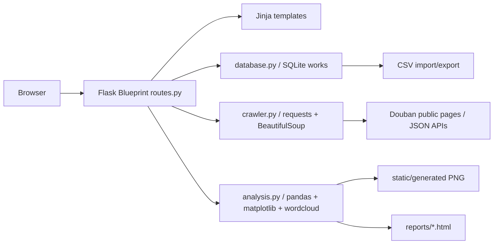

# Architecture

## Executive Summary

豆瓣肥虫是一个单进程 Flask 单体应用。应用启动时通过 `create_app` 创建 Flask 实例、加载配置、确保运行目录存在、初始化 SQLite schema，并注册主蓝图。运行期请求进入 `routes.py`，再调用数据库、爬虫或分析模块完成业务操作。所有持久化数据集中在 SQLite `works` 表，生成文件按类型写入上传、导出、报告和静态图表目录。

## Runtime Architecture

## Module Responsibilities

| Module | Responsibility | Important Functions |
| --- | --- | --- |
| `__init__.py` | Flask 应用工厂、配置加载、数据库初始化、蓝图注册、文本响应 UTF-8 头 | `create_app` |
| `config.py` | 路径、密钥、Cookie、上传/导出/报告/图表目录和分页配置 | `Config.ensure_directories` |
| `routes.py` | HTTP 路由、参数解析、模板渲染、文件上传下载、flash 消息 | `index`, `crawl`, `analysis_page`, `report_page` |
| `database.py` | SQLite schema、连接、输入规范化、去重、CRUD、查询、CSV 导入导出 | `normalize_work`, `upsert_work`, `query_works`, `import_csv` |
| `crawler.py` | 豆瓣公开搜索和详情解析、移动端/摘要 API 补全、字段合并 | `crawl_douban`, `parse_search_page`, `fetch_subject_detail` |
| `analysis.py` | 作品数据汇总、排行、图表、词云和 HTML 报告 | `summarize`, `generate_charts`, `build_report` |

## Request Flow

1. 浏览器请求 Flask 路由。
2. 路由从 `request.args`、`request.form` 或上传文件提取输入。
3. 对数据库类操作，路由调用 `database.py`，由 `normalize_work` 做字段和 URL 校验。
4. 对爬取类操作，路由调用 `crawl_douban`，成功后逐条 upsert 到 SQLite。
5. 对分析类操作，路由读取全部作品并调用 `analysis.py` 生成汇总、图表或报告。
6. 响应通常是 Jinja HTML；CSV、HTML 报告和图片代理通过 `send_file` 或 `Response` 返回。

## Data Architecture

数据库只有一个核心表 `works`。表中保存作品标题、类型、评分、评价人数、作者/导演、年份、封面链接、来源链接、标签、简介和时间戳。去重策略有两层：优先使用非空 `source_url` 唯一索引，其次使用标题、类型、年份和作者/导演组合唯一索引。

## API Design

该应用主要提供服务端渲染页面，不暴露 JSON REST API。路由契约见 [api-contracts.md](./api-contracts.md)。所有写操作通过 POST 完成，成功或失败通过 Flask flash 消息反馈，常见成功路径会重定向到列表页或详情页。

## Component Overview

Jinja 页面分为基础布局、数据列表、编辑表单、详情、爬取、分析和对比页面。前端没有单独 JavaScript 构建流程，交互主要依赖 HTML 表单和少量内联确认。CSS 使用单文件 `app.css`，布局包含 topbar、filter grid、card grid、panel、detail panel、metrics、charts 和响应式媒体查询。

## External Integration

- 豆瓣搜索页：`https://search.douban.com/{movie|book}/subject_search`
- 豆瓣详情页：标准 subject URL
- 移动端 Rexxar API：`https://m.douban.com/rexxar/api/v2/{movie|book}/{id}?ck=&for_mobile=1`
- 电影摘要 API：`https://movie.douban.com/j/subject_abstract?subject_id={id}`
- 豆瓣图片代理：只允许 `doubanio.com` 或其子域名，附加模拟浏览器 Referer。

## Configuration

| Key | Source | Default / Meaning |
| --- | --- | --- |
| `SECRET_KEY` | `DOUBAN_FATWORM_SECRET_KEY` | `dev-douban-fatworm` |
| `DOUBAN_COOKIE` | `DOUBAN_COOKIE` | 空字符串；爬取详情被拦截时可传入 |
| `DATABASE` | `Config` | `instance/douban_fatworm.sqlite3` |
| `UPLOAD_DIR` | `Config` | `uploads` |
| `EXPORT_DIR` | `Config` | `exports` |
| `REPORT_DIR` | `Config` | `reports` |
| `CHART_DIR` | `Config` | `src/douban_fatworm/static/generated` |
| `ITEMS_PER_PAGE` | `Config` | `12` |
| `MAX_CONTENT_LENGTH` | `Config` | `5 MiB` |

## Testing Strategy

测试分为四类：数据库校验与 CRUD、爬虫解析、分析图表与报告、Flask 路由。路由测试使用临时配置类把数据库和运行目录指向 `tmp_path`，避免污染真实运行目录。爬虫和图片代理相关外部请求通过 fake session 或 monkeypatch 隔离。

## Security and Safety Notes

- `validate_url` 只允许 `http` 和 `https` 链接，阻断 `javascript:` 等危险来源链接。
- 报告生成使用 `html.escape` 转义用户数据，避免导出的 HTML 注入脚本。
- 上传只接受 `.csv` 后缀，文件名通过 `secure_name` 去除危险字符。
- 图片代理只允许豆瓣图片域名，非图片 Content-Type 会返回 404。
- 本项目没有验证码处理、代理池或规避访问控制逻辑，应低频学习用途运行。

## Architectural Constraints

- SQLite 适合课程演示和单用户本地运行，不适合高并发写入。
- 爬虫依赖公开页面结构，豆瓣页面变化或安全校验会导致部分字段缺失。
- 图表生成在请求线程内同步执行，数据量很大时会增加响应时间。
- 当前没有 CSRF 防护，若要部署到公网，需要补充 Flask-WTF 或等效机制。
