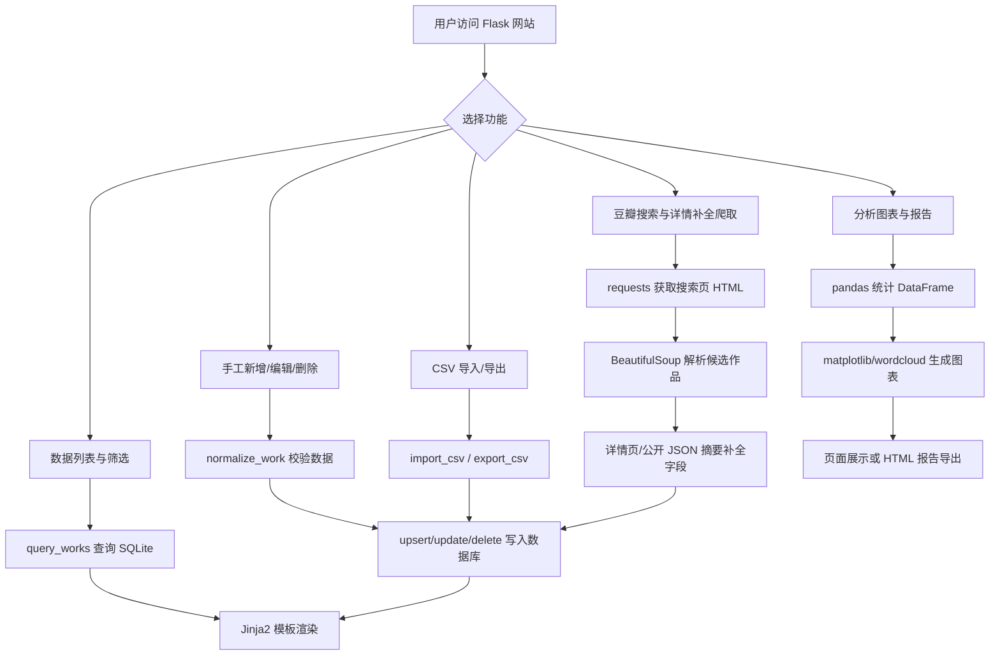

# 豆瓣肥虫数据分析网站课程设计报告

## 1 课程设计目的

（1）掌握 Python Web 应用的基本开发流程，理解 Flask 应用工厂、路由、模板渲染、静态资源组织与本地数据库访问之间的协作关系。

（2）学习 requests、BeautifulSoup、pandas、matplotlib、wordcloud、sqlite3 等常用库的综合使用方法，能够完成数据采集、数据清洗、数据存储、统计分析和可视化展示。

（3）提高面向实际问题的软件设计能力，将“豆瓣电影或图书数据分析”拆分为爬取、维护、筛选、分析、导入导出、报告生成等可实现模块。

（4）培养工程化开发习惯，使用 uv 管理 Python 环境和依赖，使用 pytest 编写测试用例，并遵守 UTF-8 编码、CRLF 换行和本地文件组织规范。

（5）增强数据安全与合规意识，明确爬虫以公开搜索页面和公开详情/摘要信息为数据来源，不实现验证码绕过、代理池或其他规避访问控制的行为。

## 2 课程设计题目及要求

本课程设计题目为“豆瓣肥虫数据分析网站”。系统面向豆瓣电影和图书信息的学习型数据分析场景，要求使用 Python 实现一个可运行的网站，能够围绕指定关键字和年份范围获取作品基本信息，并对本地数据进行维护、检索、统计和可视化展示。

根据课程题目要求，本项目需要实现以下主要内容：

（1）数据采集功能：使用 requests 和 BeautifulSoup 从豆瓣公开搜索页面获取候选作品，再通过详情页或公开 JSON 摘要补充电影的导演、年份、评分和标签等字段。爬取过程需要处理网络失败、访问限制、安全校验页和空结果，不因外部页面不可访问而破坏本地数据。

（2）数据存储功能：爬取、手工录入和 CSV 导入的数据需要保存到本地 SQLite 数据库。系统按照来源链接、标题、类型、年份、作者或导演等字段进行去重，避免重复数据影响统计结果。

（3）数据管理功能：网站前端支持新增、编辑、单条删除和批量删除作品数据，并支持 CSV 导入与导出，便于在没有网络环境时通过本地数据完成演示。

（4）检索筛选功能：系统支持按照标题或作者/导演关键字、作品类型、评分区间、年份区间进行组合筛选，并以分页卡片形式展示结果。

（5）数据分析与可视化功能：系统需要生成评分分布直方图、年份与平均评分趋势折线图、评价人数与评分散点图、标签词云、排行榜和核心统计指标。

（6）扩展展示功能：系统支持两部作品的字段对比，并能够生成包含核心指标、图表和排行榜的 HTML 分析报告。

（7）性能与工程要求：系统应能够在普通 Windows 开发环境中通过 uv 安装依赖并启动，Web 响应和生成文件使用 UTF-8 编码，前端页面具备响应式布局，测试用例能够验证核心功能的正确性。

## 3 课程设计报告内容

### 3.1 系统设计方案

本系统采用 Flask 单体 Web 应用架构。后端负责路由调度、数据库读写、爬虫调用、数据分析和报告生成；前端使用 Jinja2 模板和 CSS 实现页面展示，不依赖 Node.js 或在线 CDN。该方案适合课程设计场景，部署方式简单，运行命令清晰，便于在一台本地计算机上完成开发、演示和验收。

系统的核心功能定位是“豆瓣作品数据的本地化管理与分析”。数据来源既可以是公开搜索页爬取，也可以是手工录入或 CSV 导入。这样设计的原因是网络爬取具有不稳定性，若只依赖实时网络请求，课程演示容易受到目标网站访问限制、网络状态和页面结构变化影响。本项目将本地数据库作为系统核心，爬虫只是数据入口之一，从而保证分析、筛选、报告等功能可以稳定演示。

开发环境与框架选型如下：项目使用 Python 3.11 及以上版本，依赖由 uv 管理；Web 框架使用 Flask；数据库使用 Python 标准库 sqlite3 操作 SQLite；数据分析使用 pandas；图表使用 matplotlib；词云使用 wordcloud；网页解析使用 BeautifulSoup；自动化验证使用 pytest。

### 3.1.1 需求分析与功能分解

系统需求可以划分为六个主要功能模块。

（1）数据采集模块。该模块接收用户输入的关键字、作品类型和年份范围，构造豆瓣公开搜索页面请求，解析返回 HTML 中的作品条目。搜索页只作为候选入口，系统会继续尝试访问作品详情页；当详情页被安全校验页替代而无法取得 `#info` 时，电影数据会再调用公开的 `subject_abstract` JSON 摘要接口，使用其中的 `directors`、`release_year`、`rate` 和 `types` 补充作者/导演、年份、评分和标签。

（2）数据存储模块。该模块负责 SQLite 数据库初始化、作品新增、修改、删除、查询和去重。系统使用唯一索引约束来源链接和作品身份字段，保证重复导入或重复爬取时不会产生大量重复记录。

（3）数据维护模块。该模块提供手工新增、编辑、删除、CSV 导入和 CSV 导出功能。手工维护功能可以修正爬取不完整的数据，CSV 功能方便批量准备演示数据。

（4）检索展示模块。该模块负责首页作品列表展示，支持标题/作者/导演模糊搜索、类型筛选、评分区间筛选、年份区间筛选和分页展示。

（5）分析可视化模块。该模块基于数据库中的作品数据生成统计指标和图表，包括评分分布、年份平均评分趋势、评价人数与评分关系、标签词云和高分排行榜。

（6）扩展输出模块。该模块提供作品对比和 HTML 报告导出。报告中包含统计摘要、图表和排行榜，便于作为阶段性分析结果保存。

### 3.1.2 技术选型与依赖库

| 技术或依赖 | 版本要求 | 作用 | 选型理由 |
| --- | --- | --- | --- |
| Python | >= 3.11 | 项目运行语言 | 语法现代，标准库 sqlite3 可直接操作本地数据库 |
| uv | 本地安装版本 | 环境和依赖管理 | 安装速度快，可复现依赖环境 |
| Flask | >= 3.0.3 | Web 框架 | 轻量，适合课程项目和服务端模板渲染 |
| requests | >= 2.32.3 | HTTP 请求 | API 简洁，适合公开页面请求 |
| BeautifulSoup4 | >= 4.12.3 | HTML 解析 | 选择器使用方便，适合解析搜索结果页面 |
| pandas | >= 2.2.3 | 数据分析 | 便于进行分组统计、均值计算和排序 |
| matplotlib | >= 3.9.2 | 图表生成 | 支持直方图、折线图、散点图等常见可视化 |
| wordcloud | >= 1.9.3 | 标签词云生成 | 能直观展示高频标签 |
| pytest | >= 8.3.3 | 自动化测试 | 用于验证数据库、分析、路由和爬虫边界行为 |
| SQLite | Python 标准库 | 本地数据存储 | 无需额外服务，适合本地课程演示 |

### 3.1.3 项目文件结构规划

```text
Project/
├─ pyproject.toml                  # uv 项目配置、依赖和测试配置
├─ uv.lock                         # uv 锁定依赖版本
├─ README.md                       # 运行说明与功能说明
├─ src/
│  └─ douban_fatworm/
│     ├─ __init__.py               # Flask 应用工厂
│     ├─ config.py                 # 路径、数据库、上传和导出配置
│     ├─ database.py               # SQLite 建表、CRUD、去重、CSV 导入导出
│     ├─ crawler.py                # 豆瓣搜索页、详情页和公开摘要解析
│     ├─ analysis.py               # 数据统计、图表、词云和报告生成
│     ├─ routes.py                 # Web 路由和表单处理
│     ├─ static/css/app.css        # 响应式页面样式
│     └─ templates/                # Jinja2 页面模板
│        ├─ base.html              # 公共布局
│        ├─ index.html             # 数据列表与筛选
│        ├─ form.html              # 新增/编辑作品
│        ├─ crawl.html             # 爬取页面
│        ├─ analysis.html          # 分析图表页面
│        └─ compare.html           # 作品对比页面
├─ tests/
│  ├─ test_database.py             # 数据库功能测试
│  ├─ test_analysis.py             # 分析功能测试
│  ├─ test_routes.py               # 页面路由测试
│  └─ test_crawler.py              # 爬虫解析边界测试
└─ docs/
   └─ course_design_report.md      # 课程设计报告
```

### 3.2 核心模块设计与实现

系统核心模块按照“入口调度、数据处理、业务逻辑、界面交互”进行组织。各模块之间保持相对清晰的职责边界：路由模块负责接收请求和返回页面，数据库模块负责本地持久化，爬虫模块负责外部数据获取，分析模块负责统计和文件生成。

### 3.2.1 主程序模块（入口与调度）

主程序入口位于 `src/douban_fatworm/__init__.py`。该文件定义 `create_app()` 应用工厂函数，负责创建 Flask 应用、加载配置、创建必要目录、初始化数据库并注册路由蓝图。

该模块的输入是配置类，输出是 Flask 应用实例。应用启动时，`Config.ensure_directories()` 会创建数据库目录、上传目录、导出目录、报告目录和图表目录；`init_db()` 会执行建表 SQL，保证首次启动即可运行。`after_request` 钩子负责为文本响应补充 UTF-8 响应头，满足中文页面显示要求。

### 3.2.2 数据处理模块（数据读取、清洗、转换）

数据处理模块主要位于 `src/douban_fatworm/database.py`。数据库表 `works` 保存作品信息，字段包括标题、类型、评分、评价人数、作者/导演、年份、封面链接、来源链接、标签、简介和时间戳。

数据写入前会经过 `normalize_work()` 清洗。该函数会完成以下工作：

（1）去除字符串字段首尾空白。

（2）检查标题和类型是否有效。

（3）将评分转换为浮点数，并限制在 0 到 10 之间。

（4）将年份转换为整数，并限制在合理年份范围内。

（5）将评价人数转换为非负整数。

数据库去重由 `upsert_work()` 和 `find_duplicate()` 完成。系统优先使用来源链接去重；如果来源链接为空，则按标题、类型、年份和作者/导演组合判断是否为同一作品。CSV 导入由 `import_csv()` 完成，要求至少包含 `title` 和 `work_type` 两列；导出由 `export_csv()` 完成，导出文件使用 UTF-8 编码。

### 3.2.3 业务逻辑模块（核心算法/功能实现）

业务逻辑主要包括爬虫逻辑和分析逻辑。

爬虫逻辑位于 `src/douban_fatworm/crawler.py`。`crawl_douban()` 接收关键字、作品类型、起始年份、结束年份和可选豆瓣 Cookie，构造豆瓣公开搜索请求。请求失败、HTTP 403、HTTP 429 或解析不到结果时，函数返回错误信息而不是抛出未处理异常。`parse_search_page()` 使用 BeautifulSoup CSS 选择器遍历搜索结果条目，`enrich_with_subject_pages()` 再尝试进入详情页补充字段。

作者/导演字段的处理是本项目爬虫模块的一个关键点。豆瓣浏览器页面中可以看到 `导演:`，但 Python 脚本直接访问详情页时可能被重定向到 `sec.douban.com` 安全校验页，该页面不包含 `#info`，因此无法从 HTML 中解析导演。为降低这种不稳定性，系统在详情页解析失败或字段为空时，会调用 `https://movie.douban.com/j/subject_abstract?subject_id=...` 公开摘要接口，读取其中的 `directors` 字段作为电影的作者/导演。爬取页也提供可选 Cookie 输入框，用于在学习演示场景下复用浏览器已通过校验的会话状态；该 Cookie 只用于当前请求，不写入数据库。

分析逻辑位于 `src/douban_fatworm/analysis.py`。该模块先将 SQLite 查询结果转换为 pandas DataFrame，再计算统计指标和生成图表。核心分析功能包括：

（1）`summarize()`：统计作品总数、平均评分、最高分作品、评价人数最多作品、年份覆盖数和高频标签。

（2）`generate_charts()`：生成评分分布直方图、年份平均评分趋势折线图、评价人数与评分散点图、标签词云。

（3）`ranking()`：按评分和评价人数生成排行榜。

（4）`build_report()`：生成 HTML 分析报告，并将图表以内嵌 Base64 图片形式写入报告，避免报告移动后图片丢失。

### 3.2.4 界面/交互模块（CLI/GUI/API）

界面交互模块由 `src/douban_fatworm/routes.py` 和 `templates/` 下的 Jinja2 模板组成。系统采用服务端渲染方式，用户通过浏览器访问各功能页面。

主要页面如下：

（1）首页 `/`：展示作品卡片，支持标题/作者/导演搜索、类型筛选、评分筛选、年份筛选、分页、CSV 导入、CSV 导出、单条删除和批量删除。

（2）新增页面 `/works/new`：提交作品标题、类型、评分、评价人数、作者/导演、年份、封面、来源、标签和简介。

（3）编辑页面 `/works/<id>/edit`：修改已有作品信息。若修改后与已有作品重复，系统会提示“该作品与已有数据重复”。

（4）爬取页面 `/crawl`：输入关键字、类型和年份范围，触发豆瓣公开搜索页爬取；可选填写豆瓣 Cookie，用于详情页被安全校验拦截时提高字段补全成功率。

（5）分析页面 `/analysis`：展示核心指标、图表、词云和排行榜。

（6）对比页面 `/compare`：选择两部作品，对比类型、作者/导演、年份、评分、评价人数和标签。

（7）报告导出 `/report`：生成并下载 HTML 分析报告。

前端样式位于 `src/douban_fatworm/static/css/app.css`。页面使用卡片、表单、表格和响应式网格布局，在桌面端和移动端均可基本使用。

### 3.3 程序流程与关键代码说明

系统整体执行逻辑以 Flask 路由为入口。用户发起请求后，路由函数根据功能调用数据库、爬虫或分析模块，最后返回 HTML 页面或文件下载响应。

### 3.3.1 总体程序流程图



### 3.3.2 关键函数/类的接口设计与调用关系

| 函数或类 | 所在文件 | 输入 | 输出 | 主要作用 |
| --- | --- | --- | --- | --- |
| `create_app()` | `__init__.py` | 配置类 | Flask 应用实例 | 创建应用、初始化数据库、注册路由 |
| `Config` | `config.py` | 无 | 配置属性 | 统一管理数据库、上传、导出、报告、图表目录 |
| `init_db()` | `database.py` | 数据库路径 | 无 | 创建作品表和唯一索引 |
| `normalize_work()` | `database.py` | 表单/CSV/爬虫字典 | 标准化字典 | 清洗并校验作品字段 |
| `upsert_work()` | `database.py` | 数据库路径、作品字典 | 作品 ID 和新增标记 | 去重写入或更新作品 |
| `query_works()` | `database.py` | 筛选条件、页码、页大小 | `QueryResult` | 首页组合筛选与分页 |
| `crawl_douban()` | `crawler.py` | 关键字、类型、年份范围、可选 Cookie | `CrawlResult` | 请求豆瓣搜索页并补全详情字段 |
| `parse_search_page()` | `crawler.py` | HTML、作品类型 | 作品列表 | 解析搜索结果候选条目 |
| `fetch_subject_detail()` | `crawler.py` | 来源链接、作品类型、会话 | 字段字典 | 尝试解析详情页并调用摘要接口补充导演等字段 |
| `fetch_subject_abstract_detail()` | `crawler.py` | 豆瓣 subject 链接、作品类型、会话 | 字段字典 | 通过公开 JSON 摘要获取电影导演、年份、评分和类型 |
| `summarize()` | `analysis.py` | 数据库查询结果 | 统计字典 | 计算总数、均分、最高分和标签统计 |
| `generate_charts()` | `analysis.py` | 数据库查询结果、输出目录 | 图表路径字典 | 生成评分、年份、散点和词云图 |
| `build_report()` | `analysis.py` | 数据、图表、输出路径 | 报告路径 | 生成 HTML 分析报告 |

核心调用关系可以概括为：

```text
浏览器请求
  -> routes.py 路由函数
    -> database.py 读取或写入 SQLite
    -> crawler.py 获取搜索页候选数据并补全详情字段
    -> analysis.py 生成统计图表或报告
  -> templates/*.html 渲染页面
```

### 3.4 系统运行与测试结果

系统运行前需要在项目根目录执行以下命令：

```powershell
[Console]::OutputEncoding = [System.Text.Encoding]::UTF8
uv sync --extra dev
uv run flask --app douban_fatworm run
```

启动成功后，在浏览器访问 `http://127.0.0.1:5000` 即可进入首页。首次启动会自动创建 `instance/douban_fatworm.sqlite3` 数据库文件。

### 3.4.1 功能运行结果

（1）首页数据管理：系统能够展示作品卡片，卡片中包含封面、类型、年份、标题、作者/导演、评分、评价人数、标签、编辑、删除和来源链接。用户可以勾选多条作品后批量删除。无数据时显示空态提示。

（2）数据筛选：用户可以输入关键字，并设置作品类型、最低评分、最高评分、起始年份和结束年份。非法数字参数不会导致系统 500 错误，系统会提示部分筛选条件无效并忽略。

（3）手工维护：用户可以通过表单新增或编辑作品。必填字段为空、评分超出范围、年份不合理、重复数据等情况会返回可读错误提示。

（4）CSV 导入导出：系统支持上传 `.csv` 文件，要求至少包含 `title` 和 `work_type` 列。导出功能会将当前数据库作品数据保存为 UTF-8 CSV 文件。

（5）爬虫功能：用户可以输入关键字、作品类型和年份范围触发爬取。系统会对网络失败、403、429、安全校验页和空结果给出提示或降级处理，避免外部网络异常影响本地数据。对于电影条目，系统会在详情页不可解析时使用公开摘要接口补充导演字段。

（6）分析功能：分析页能够展示作品数量、平均评分、年份覆盖数、评分分布直方图、年份趋势折线图、评价人数与评分散点图、标签词云和高分排行榜。

（7）对比和报告：用户可以选择两部作品对比字段差异，也可以导出包含统计摘要、图表和排行榜的 HTML 报告。

### 3.4.2 自动化测试结果

项目使用 pytest 进行自动化测试，测试命令如下：

```powershell
uv run pytest
```

当前测试结果为：

```text
collected 27 items
tests/test_analysis.py .....     [ 18%]
tests/test_crawler.py ........   [ 48%]
tests/test_database.py .......   [ 74%]
tests/test_routes.py .......     [100%]
27 passed
```

测试覆盖内容包括：

（1）数据库去重写入、筛选查询、CSV 导入导出、重复编辑错误处理。

（2）空数据分析、高分排行榜、图表生成、无评分数据均值处理、报告 HTML 转义和图表内嵌。

（3）首页、分析页、对比页和爬取页的基本渲染，批量删除、可选 Cookie 传递，以及非法查询参数不导致 500 错误。

（4）爬虫解析空页面时返回空列表，年份筛选会排除无年份条目，详情页解析会从正确位置读取简介、年份和导演，并在电影详情页受安全校验影响时通过公开 JSON 摘要补充导演。

### 3.5 编码规范与安全边界

本项目要求源码、配置、Web 响应和导出文件使用 UTF-8。项目中的主要文本文件已经按 UTF-8 without BOM 和 CRLF 换行保存。Web 响应通过 Flask 的 `after_request` 钩子补充 UTF-8 响应头，CSV 读写使用 UTF-8 或 UTF-8-SIG 兼容处理。

爬虫部分严格限定为学习用途下的公开页面和公开摘要访问，不包含验证码识别、代理池、自动绕过访问控制等行为。爬取页的 Cookie 输入只用于用户主动提供浏览器会话的临时请求，不保存到数据库。README 中也明确提示低频、少量运行，并遵守目标网站 robots、服务条款和版权要求。

HTML 报告生成时会对用户可控字段进行转义，降低手工输入或 CSV 导入内容造成 HTML 注入的风险。报告图表以内嵌 Base64 形式保存，减少报告移动后图片路径失效的问题。

## 4 总结

本课程设计完成了一个基于 Python 的豆瓣肥虫数据分析网站。系统围绕“数据采集、数据存储、数据管理、检索筛选、统计分析、可视化展示、报告导出”形成了完整闭环。通过 Flask 和 Jinja2 实现 Web 页面，通过 SQLite 实现本地持久化，通过 pandas、matplotlib 和 wordcloud 实现数据分析与图表展示，通过 pytest 对核心功能进行验证。

从实现过程看，单体 Flask 架构适合本课程设计：它部署简单、依赖较少、便于展示完整功能。与前后端分离方案相比，当前方案降低了 Node.js、接口联调和构建部署复杂度，更符合“用 Python 完成数据分析网站”的课程目标。

本项目仍有进一步优化空间。例如，可以增加更丰富的图表类型，提供数据清洗规则配置，扩展更多数据源，改进爬虫解析稳定性，或在后续版本中引入 Vue 前端实现更复杂的交互。但就课程设计要求而言，当前系统已经能够完整展示 Python Web、爬虫、数据库、数据分析和可视化的综合应用能力。

## 参考文献

[1] Hunter J D. Matplotlib: A 2D Graphics Environment[J]. Computing in Science & Engineering, 2007, 9(3):90-95.

[2] McKinney W. Data Structures for Statistical Computing in Python[A]. Proceedings of the 9th Python in Science Conference[C]. Austin: SciPy, 2010.56-61.

[3] Grinberg M. Flask Web Development: Developing Web Applications with Python[M]. Sebastopol: O'Reilly Media, 2018.

[4] Richardson L. Beautiful Soup Documentation[EB/OL]. https://www.crummy.com/software/BeautifulSoup/bs4/doc/, 2024-04-01/2026-06-22.

[5] SQLite Consortium. SQLite Documentation[EB/OL]. https://www.sqlite.org/docs.html, 2026-06-22/2026-06-22.

[6] Astral Software Inc. uv Documentation[EB/OL]. https://docs.astral.sh/uv/, 2026-06-22/2026-06-22.
